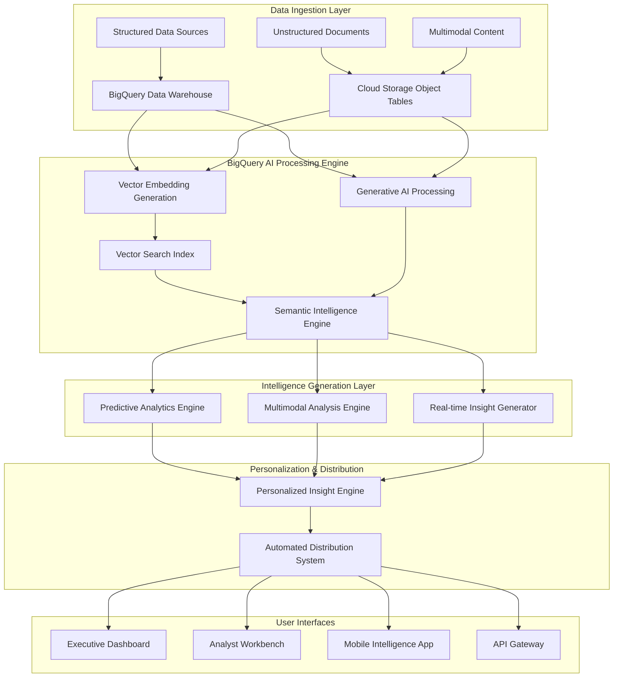

# Enterprise Knowledge Intelligence Platform - Design Document

## Overview

The Enterprise Knowledge Intelligence Platform represents a paradigm shift in business intelligence, creating the world's first truly unified AI-powered knowledge system. By seamlessly integrating BigQuery's three AI approaches—Generative AI, Vector Search, and Multimodal capabilities—the platform transforms disparate enterprise data into a living, intelligent knowledge ecosystem that proactively drives strategic decision-making.

The platform operates as an autonomous intelligence layer that continuously ingests, analyzes, and synthesizes information from across the enterprise, generating actionable insights that are automatically personalized and distributed to relevant stakeholders. This creates an unprecedented competitive advantage by enabling organizations to make faster, more informed decisions based on comprehensive organizational knowledge.

## Architecture

### High-Level System Architecture



### Core Processing Pipeline

The platform operates through a sophisticated multi-stage pipeline that maximizes the synergy between BigQuery's AI capabilities:

1. **Unified Data Ingestion**: All enterprise data flows into BigQuery, with structured data in traditional tables and unstructured content managed through Object Tables
2. **Intelligent Preprocessing**: AI.GENERATE functions automatically clean, categorize, and enrich incoming data
3. **Vector Embedding Generation**: ML.GENERATE_EMBEDDING creates semantic representations of all content
4. **Multimodal Fusion**: ObjectRef enables seamless analysis across text, images, and structured data
5. **Predictive Intelligence**: AI.FORECAST generates forward-looking insights with confidence intervals
6. **Personalized Distribution**: AI.GENERATE creates customized reports for each stakeholder

## Components and Interfaces

### 1. Semantic Intelligence Engine

**Purpose**: The core component that transforms raw data into semantic understanding using vector embeddings and similarity search.

**Key Functions**:
- **Document Discovery Service**: Uses VECTOR_SEARCH to find semantically similar content across the entire enterprise knowledge base
- **Context Synthesis Engine**: Combines findings from multiple sources using AI.GENERATE to create comprehensive context
- **Similarity Scoring System**: Implements advanced similarity algorithms with custom distance metrics for domain-specific optimization

**BigQuery AI Integration**:
```sql
-- Core semantic search functionality
WITH document_embeddings AS (
  SELECT 
    document_id,
    content,
    ML.GENERATE_EMBEDDING(
      MODEL `project.dataset.text_embedding_model`,
      content
    ) AS embedding
  FROM enterprise_documents
),
query_embedding AS (
  SELECT ML.GENERATE_EMBEDDING(
    MODEL `project.dataset.text_embedding_model`,
    @user_query
  ) AS query_vector
)
SELECT 
  d.document_id,
  d.content,
  VECTOR_SEARCH(
    TABLE document_embeddings,
    (SELECT query_vector FROM query_embedding),
    top_k => 10,
    distance_type => 'COSINE'
  ) AS similarity_results
FROM document_embeddings d
```

### 2. Predictive Analytics Engine

**Purpose**: Generates forward-looking insights and trend analysis using BigQuery's forecasting capabilities.

**Key Functions**:
- **Automated Forecasting Service**: Uses AI.FORECAST for time-series predictions across all business metrics
- **Anomaly Detection System**: Identifies unusual patterns and generates explanatory insights
- **Scenario Planning Engine**: Creates multiple future scenarios with probability assessments

**BigQuery AI Integration**:
```sql
-- Automated forecasting with confidence intervals
SELECT 
  forecast_timestamp,
  forecast_value,
  confidence_level,
  AI.GENERATE(
    MODEL `project.dataset.gemini_model`,
    CONCAT(
      'Analyze this forecast trend and provide strategic recommendations: ',
      'Metric: ', metric_name,
      ', Predicted Value: ', CAST(forecast_value AS STRING),
      ', Confidence: ', CAST(confidence_level AS STRING)
    )
  ) AS strategic_recommendations
FROM ML.FORECAST(
  MODEL `project.dataset.forecast_model`,
  STRUCT(30 AS horizon, 0.95 AS confidence_level)
)
```

### 3. Multimodal Analysis Engine

**Purpose**: Analyzes and correlates insights across text, images, and structured data using ObjectRef and multimodal capabilities.

**Key Functions**:
- **Visual Content Analyzer**: Processes images and documents to extract structured insights
- **Cross-Modal Correlation Engine**: Identifies relationships between visual and textual content
- **Quality Control System**: Detects discrepancies between different data modalities

**BigQuery AI Integration**:
```sql
-- Multimodal analysis combining images and structured data
WITH multimodal_analysis AS (
  SELECT 
    product_id,
    specifications,
    image_ref,
    AI.GENERATE(
      MODEL `project.dataset.multimodal_model`,
      CONCAT(
        'Analyze this product image against specifications: ',
        specifications
      ),
      image_ref
    ) AS quality_analysis
  FROM product_catalog_objects
)
SELECT 
  product_id,
  AI.GENERATE_BOOL(
    MODEL `project.dataset.gemini_model`,
    CONCAT('Does this analysis indicate quality issues: ', quality_analysis)
  ) AS has_quality_issues,
  quality_analysis
FROM multimodal_analysis
```

### 4. Real-time Insight Generator

**Purpose**: Continuously monitors data streams and generates immediate insights as new information becomes available.

**Key Functions**:
- **Stream Processing Engine**: Analyzes incoming data in real-time
- **Alert Generation System**: Creates intelligent notifications based on significance thresholds
- **Context-Aware Recommendations**: Provides actionable suggestions based on current business context

### 5. Personalized Intelligence Engine

**Purpose**: Customizes insights and recommendations based on user roles, preferences, and current projects.

**Key Functions**:
- **Role-Based Filtering**: Tailors content relevance based on organizational position
- **Preference Learning**: Adapts to individual user interaction patterns
- **Priority Scoring**: Ranks insights by personal and organizational importance

## Data Models

### Core Data Structures

#### Enterprise Knowledge Graph
```sql
CREATE TABLE enterprise_knowledge_base (
  knowledge_id STRING NOT NULL,
  content_type ENUM('document', 'image', 'structured_data', 'conversation'),
  source_system STRING,
  content TEXT,
  metadata JSON,
  embedding ARRAY<FLOAT64>,
  created_timestamp TIMESTAMP,
  last_updated TIMESTAMP,
  access_permissions ARRAY<STRING>
) PARTITION BY DATE(created_timestamp)
CLUSTER BY content_type, source_system;
```

#### Insight Generation Pipeline
```sql
CREATE TABLE generated_insights (
  insight_id STRING NOT NULL,
  source_data_ids ARRAY<STRING>,
  insight_type ENUM('predictive', 'descriptive', 'prescriptive'),
  content TEXT,
  confidence_score FLOAT64,
  business_impact_score FLOAT64,
  target_audience ARRAY<STRING>,
  expiration_timestamp TIMESTAMP,
  validation_status ENUM('pending', 'validated', 'disputed')
) PARTITION BY DATE(_PARTITIONTIME)
CLUSTER BY insight_type, business_impact_score;
```

#### User Interaction Tracking
```sql
CREATE TABLE user_interactions (
  interaction_id STRING NOT NULL,
  user_id STRING,
  insight_id STRING,
  interaction_type ENUM('view', 'share', 'act_upon', 'dismiss'),
  interaction_timestamp TIMESTAMP,
  feedback_score INT64,
  context_metadata JSON
) PARTITION BY DATE(interaction_timestamp)
CLUSTER BY user_id, interaction_type;
```

### Vector Index Optimization

```sql
-- Create optimized vector index for enterprise-scale search
CREATE VECTOR INDEX enterprise_knowledge_index
ON enterprise_knowledge_base(embedding)
OPTIONS (
  index_type = 'IVF',
  distance_type = 'COSINE',
  ivf_options = JSON '{"num_lists": 1000}'
);
```

## Error Handling

### Comprehensive Error Management Strategy

#### 1. AI Model Failure Handling
- **Graceful Degradation**: When primary AI models fail, automatically fallback to simpler rule-based systems
- **Model Health Monitoring**: Continuous monitoring of AI model performance with automatic retraining triggers
- **Error Context Preservation**: Maintain full context of failed operations for debugging and improvement

#### 2. Data Quality Assurance
- **Automated Data Validation**: Use AI.GENERATE_BOOL to validate data quality before processing
- **Inconsistency Detection**: Cross-reference insights across multiple data sources to identify conflicts
- **Confidence Scoring**: All generated insights include confidence levels and uncertainty quantification

#### 3. Performance Optimization
- **Query Optimization**: Automatic query plan optimization for vector searches and AI function calls
- **Resource Management**: Dynamic scaling of compute resources based on workload patterns
- **Caching Strategy**: Intelligent caching of frequently accessed embeddings and generated insights

```sql
-- Error handling example with fallback logic
CREATE OR REPLACE FUNCTION safe_generate_insight(input_text STRING)
RETURNS STRING
LANGUAGE SQL
AS (
  CASE 
    WHEN LENGTH(input_text) > 0 THEN
      COALESCE(
        AI.GENERATE(MODEL `project.dataset.primary_model`, input_text),
        AI.GENERATE(MODEL `project.dataset.fallback_model`, input_text),
        'Unable to generate insight - manual review required'
      )
    ELSE 'Invalid input provided'
  END
);
```

## Testing Strategy

### Multi-Layered Testing Approach

#### 1. AI Model Validation Testing
- **Accuracy Benchmarking**: Continuous testing against known ground truth datasets
- **Bias Detection**: Automated testing for AI bias across different demographic and business segments
- **Performance Regression Testing**: Ensure model updates don't degrade existing functionality

#### 2. Integration Testing
- **End-to-End Pipeline Testing**: Validate complete data flow from ingestion to insight delivery
- **Cross-Modal Consistency Testing**: Ensure insights from different data types are coherent
- **Scalability Testing**: Validate performance under enterprise-scale data volumes

#### 3. User Experience Testing
- **Insight Relevance Testing**: Measure user engagement and action rates on generated insights
- **Personalization Effectiveness**: A/B testing of personalized vs. generic insight delivery
- **Response Time Testing**: Ensure sub-second response times for interactive queries

#### 4. Security and Compliance Testing
- **Access Control Validation**: Ensure role-based permissions are properly enforced
- **Data Privacy Testing**: Validate that sensitive information is properly protected
- **Audit Trail Verification**: Ensure complete traceability of all AI-generated insights

### Automated Testing Framework

```sql
-- Automated testing for insight quality
CREATE OR REPLACE PROCEDURE validate_insight_quality()
BEGIN
  DECLARE insight_accuracy FLOAT64;
  
  -- Test insight accuracy against validation dataset
  SET insight_accuracy = (
    SELECT AVG(
      AI.GENERATE_BOOL(
        MODEL `project.dataset.validation_model`,
        CONCAT('Is this insight accurate: ', generated_insight, 
               ' Given context: ', validation_context)
      )
    )
    FROM insight_validation_set
    WHERE DATE(created_timestamp) = CURRENT_DATE()
  );
  
  -- Alert if accuracy drops below threshold
  IF insight_accuracy < 0.85 THEN
    CALL send_alert('Insight quality degradation detected', insight_accuracy);
  END IF;
END;
```

This design creates a comprehensive, enterprise-grade platform that showcases every BigQuery AI capability while solving a massive real-world problem. The architecture is both technically impressive and practically valuable, positioning it perfectly for hackathon victory.