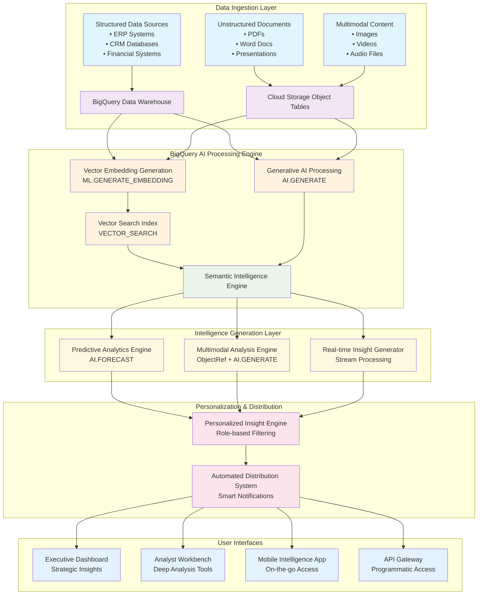
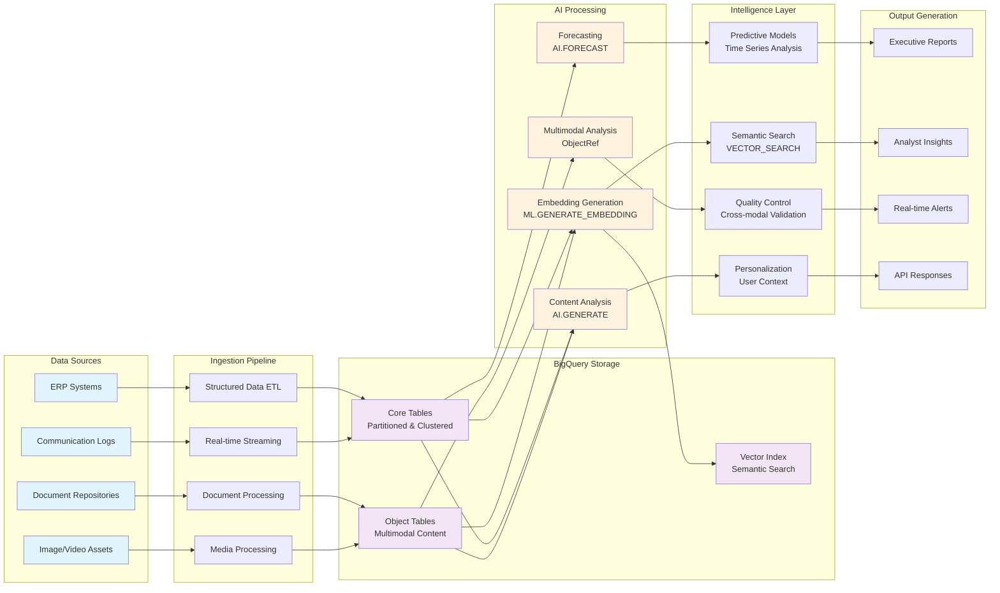
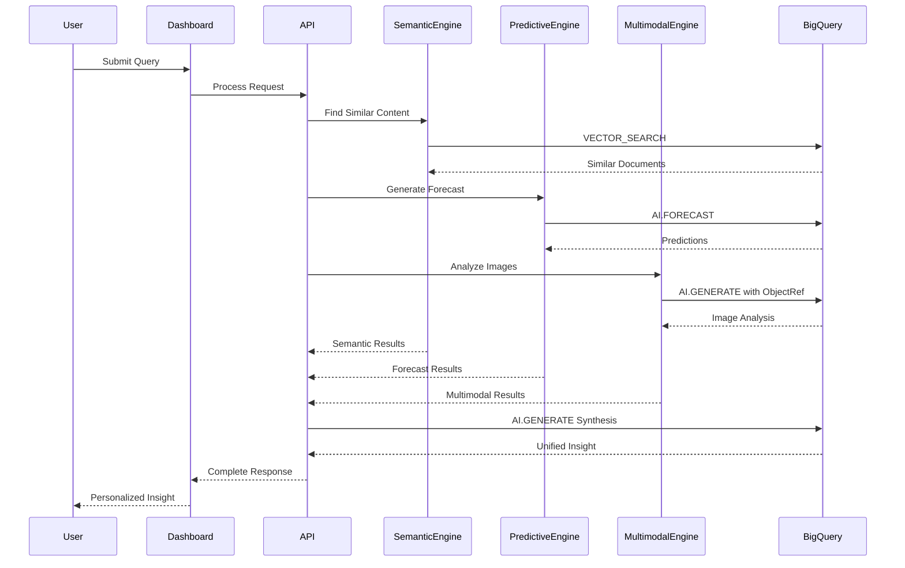
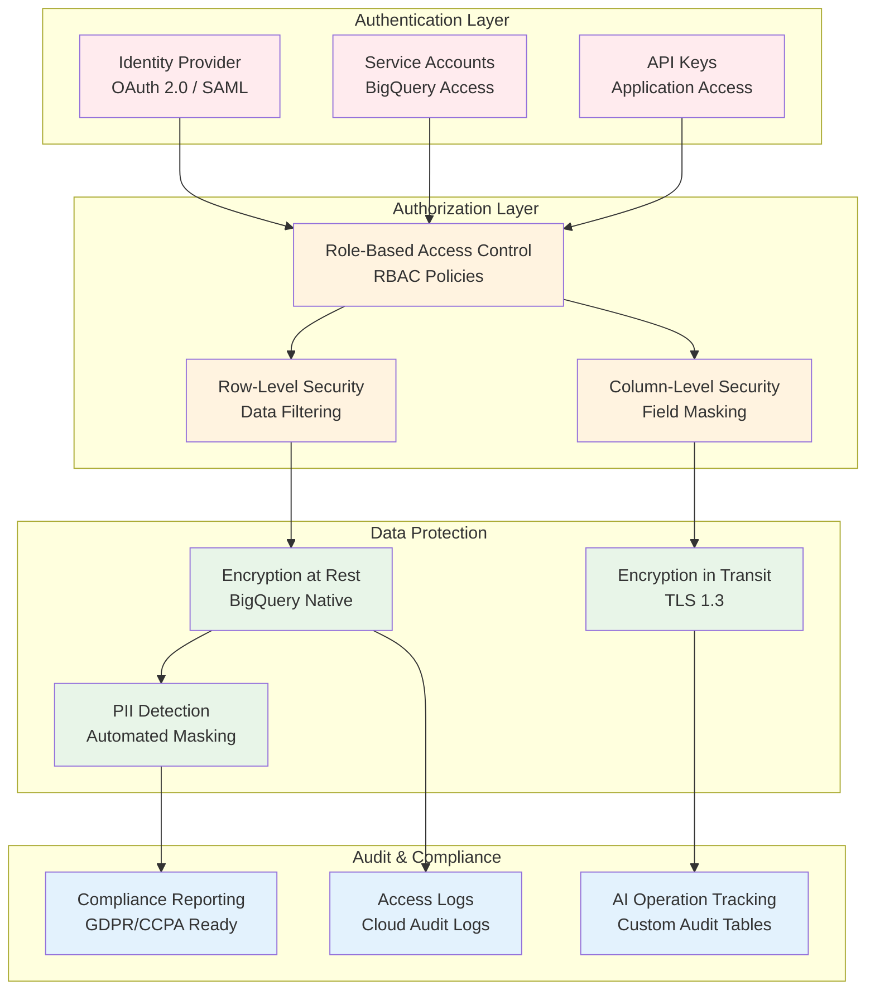
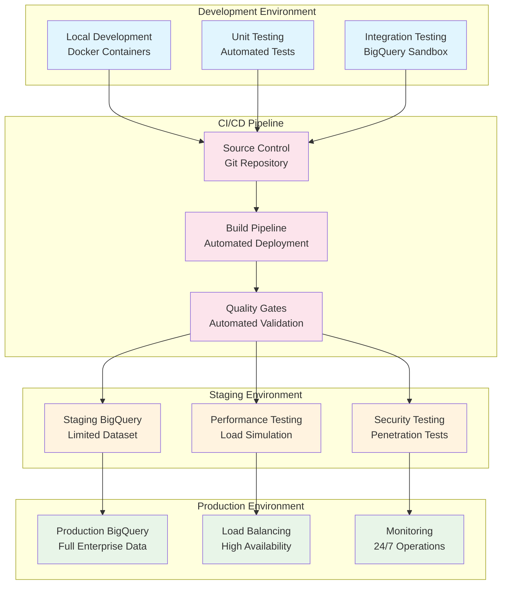
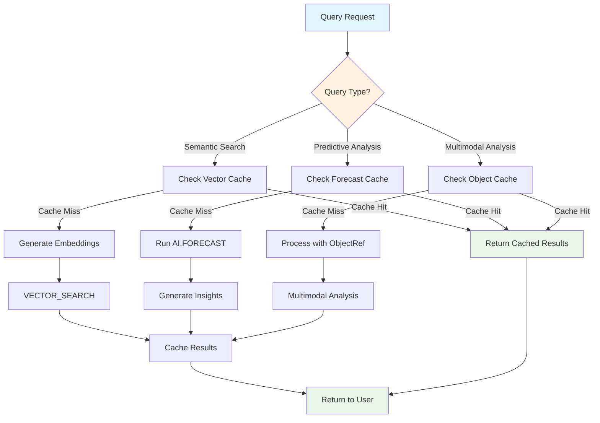
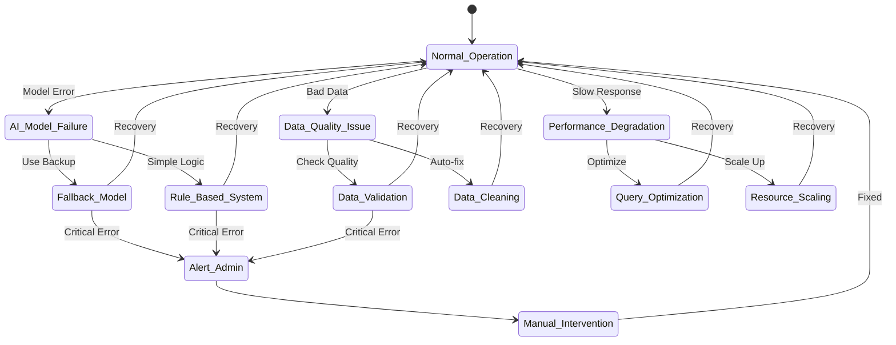
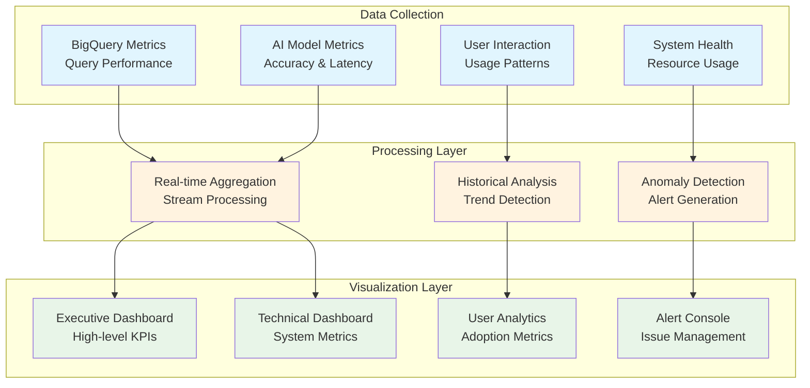

# Enterprise Knowledge Intelligence Platform - Architecture Diagrams

## System Architecture Overview

## Data Flow Architecture

## Component Interaction Diagram

## Security Architecture

## Deployment Architecture

## Performance Optimization Flow

## Error Handling & Recovery

## Monitoring Dashboard Architecture

These architectural diagrams provide comprehensive visual representations of the Enterprise Knowledge Intelligence Platform's structure, data flow, security model, deployment strategy, and operational aspects.