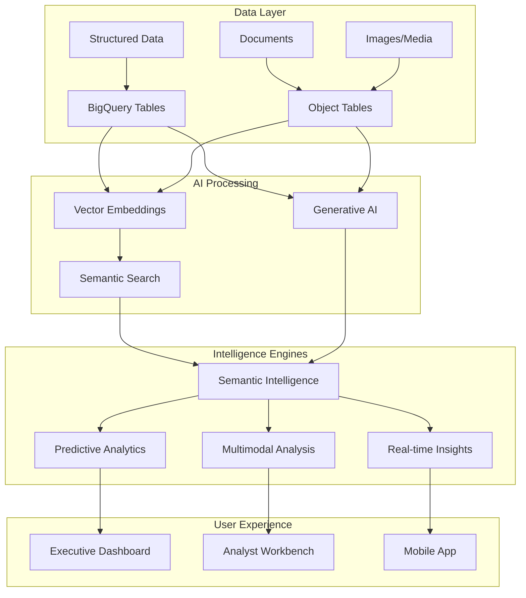

# Enterprise Knowledge Intelligence Platform - Technical Documentation

## Table of Contents
1. [Architecture Overview](#architecture-overview)
2. [Component Details](#component-details)
3. [BigQuery AI Integration](#bigquery-ai-integration)
4. [Code Examples](#code-examples)
5. [Deployment Guide](#deployment-guide)
6. [Performance Optimization](#performance-optimization)
7. [Security & Compliance](#security--compliance)

## Architecture Overview

The Enterprise Knowledge Intelligence Platform represents a revolutionary approach to business intelligence, seamlessly integrating BigQuery's three AI approaches:

- **Generative AI**: AI.GENERATE functions for content creation and analysis
- **Vector Search**: ML.GENERATE_EMBEDDING and VECTOR_SEARCH for semantic understanding
- **Multimodal**: ObjectRef for analyzing images, documents, and structured data together

### System Architecture Diagram



## Component Details

### 1. Semantic Intelligence Engine

**Location**: `semantic-intelligence/`

The core component that transforms raw enterprise data into semantic understanding using vector embeddings.

**Key Files**:
- `embedding_pipeline.sql` - Generates embeddings for all content types
- `vector_search.sql` - Implements semantic search functionality
- `context_synthesis.sql` - Combines insights from multiple sources
- `similarity_scoring.sql` - Advanced similarity algorithms

**Core Functionality**:
```sql
-- Example: Semantic document discovery
WITH document_embeddings AS (
  SELECT 
    document_id,
    content,
    ML.GENERATE_EMBEDDING(
      MODEL `project.dataset.text_embedding_model`,
      content
    ) AS embedding
  FROM enterprise_documents
)
SELECT 
  document_id,
  content,
  VECTOR_SEARCH(
    TABLE document_embeddings,
    @query_embedding,
    top_k => 10
  ) AS similarity_results
FROM document_embeddings
```

### 2. Predictive Analytics Engine

**Location**: `predictive-analytics/`

Generates forward-looking insights using BigQuery's forecasting capabilities.

**Key Files**:
- `automated_forecasting.sql` - AI.FORECAST implementation
- `anomaly_detection.sql` - Pattern recognition and alerts
- `scenario_planning.sql` - Multiple future scenario generation
- `confidence_intervals.sql` - Statistical confidence calculations

**Core Functionality**:
```sql
-- Example: Automated business forecasting
SELECT 
  forecast_timestamp,
  forecast_value,
  confidence_level,
  AI.GENERATE(
    MODEL `project.dataset.gemini_model`,
    CONCAT('Analyze forecast: ', CAST(forecast_value AS STRING))
  ) AS strategic_recommendations
FROM ML.FORECAST(
  MODEL `project.dataset.forecast_model`,
  STRUCT(30 AS horizon, 0.95 AS confidence_level)
)
```

### 3. Multimodal Analysis Engine

**Location**: `multimodal-analysis/`

Analyzes and correlates insights across text, images, and structured data.

**Key Files**:
- `visual_content_analyzer.sql` - Image processing with ObjectRef
- `cross_modal_correlation.sql` - Relationships between data types
- `quality_control_system.sql` - Discrepancy detection
- `comprehensive_multimodal_analysis.sql` - Unified analysis

**Core Functionality**:
```sql
-- Example: Product quality analysis
WITH multimodal_analysis AS (
  SELECT 
    product_id,
    specifications,
    image_ref,
    AI.GENERATE(
      MODEL `project.dataset.multimodal_model`,
      CONCAT('Analyze product image: ', specifications),
      image_ref
    ) AS quality_analysis
  FROM product_catalog_objects
)
SELECT 
  product_id,
  AI.GENERATE_BOOL(
    MODEL `project.dataset.gemini_model`,
    CONCAT('Quality issues detected: ', quality_analysis)
  ) AS has_issues
FROM multimodal_analysis
```

## BigQuery AI Integration

### Vector Search Implementation

The platform leverages BigQuery's vector search capabilities for semantic understanding:

```sql
-- Create optimized vector index
CREATE VECTOR INDEX enterprise_knowledge_index
ON enterprise_knowledge_base(embedding)
OPTIONS (
  index_type = 'IVF',
  distance_type = 'COSINE',
  ivf_options = JSON '{"num_lists": 1000}'
);
```

### Generative AI Functions

All content generation uses BigQuery's AI.GENERATE functions:

```sql
-- Generate personalized insights
SELECT 
  user_id,
  AI.GENERATE(
    MODEL `project.dataset.gemini_model`,
    CONCAT(
      'Create personalized insight for role: ', user_role,
      ' based on data: ', data_summary
    )
  ) AS personalized_insight
FROM user_context_data
```

### Multimodal Processing

ObjectRef enables seamless analysis across data types:

```sql
-- Analyze documents with images
SELECT 
  document_id,
  AI.GENERATE(
    MODEL `project.dataset.multimodal_model`,
    'Analyze this document and extract key insights',
    document_ref
  ) AS document_analysis
FROM document_objects
```

## Deployment Guide

### Prerequisites

1. **BigQuery Setup**:
   - Enable BigQuery API
   - Create dataset with appropriate permissions
   - Configure AI models (Gemini, embedding models)

2. **Authentication**:
   - Service account with BigQuery permissions
   - Cloud Storage access for Object Tables
   - AI Platform model access

### Step-by-Step Deployment

1. **Initialize BigQuery Environment**:
   ```bash
   cd bigquery-setup
   chmod +x deploy.sh
   ./deploy.sh
   ```

2. **Deploy Core Components**:
   ```bash
   # Deploy semantic intelligence
   cd semantic-intelligence
   bq query --use_legacy_sql=false < deploy_semantic_engine.sql
   
   # Deploy predictive analytics
   cd ../predictive-analytics
   bq query --use_legacy_sql=false < deploy_predictive_engine.sql
   
   # Deploy multimodal analysis
   cd ../multimodal-analysis
   bq query --use_legacy_sql=false < deploy_multimodal_engine.sql
   ```

3. **Configure User Interface**:
   ```bash
   cd user-interface
   pip install -r requirements.txt
   python api/main.py
   ```

### Validation

Run comprehensive tests to ensure proper deployment:

```bash
# Run all validation tests
cd error-handling
bq query --use_legacy_sql=false < run_unified_tests.sql
```

## Performance Optimization

### Query Optimization

The platform includes automatic query optimization for vector searches:

```sql
-- Optimized semantic search with caching
WITH cached_embeddings AS (
  SELECT * FROM enterprise_knowledge_base
  WHERE DATE(last_updated) >= DATE_SUB(CURRENT_DATE(), INTERVAL 7 DAY)
),
search_results AS (
  SELECT 
    knowledge_id,
    content,
    VECTOR_SEARCH(
      TABLE cached_embeddings,
      @query_vector,
      top_k => 50,
      distance_type => 'COSINE'
    ) AS similarity
  FROM cached_embeddings
)
SELECT * FROM search_results
WHERE similarity.distance < 0.3
ORDER BY similarity.distance
LIMIT 10
```

### Resource Scaling

Dynamic resource allocation based on workload:

```sql
-- Monitor query performance
CREATE OR REPLACE VIEW query_performance_metrics AS
SELECT 
  DATE(creation_time) as query_date,
  AVG(total_slot_ms) as avg_slot_usage,
  COUNT(*) as query_count,
  AVG(total_bytes_processed) as avg_bytes_processed
FROM `region-us`.INFORMATION_SCHEMA.JOBS_BY_PROJECT
WHERE job_type = 'QUERY'
  AND DATE(creation_time) >= DATE_SUB(CURRENT_DATE(), INTERVAL 30 DAY)
GROUP BY query_date
ORDER BY query_date DESC
```

## Security & Compliance

### Role-Based Access Control

```sql
-- Implement row-level security
CREATE ROW ACCESS POLICY user_data_access_policy
ON enterprise_knowledge_base
GRANT TO ('user:analyst@company.com')
FILTER USING (
  'analyst' IN UNNEST(access_permissions)
  OR SESSION_USER() = 'admin@company.com'
)
```

### Data Privacy Protection

```sql
-- Automatic PII detection and masking
CREATE OR REPLACE FUNCTION mask_sensitive_data(content STRING)
RETURNS STRING
LANGUAGE SQL
AS (
  REGEXP_REPLACE(
    REGEXP_REPLACE(content, r'\b\d{3}-\d{2}-\d{4}\b', 'XXX-XX-XXXX'),
    r'\b[A-Za-z0-9._%+-]+@[A-Za-z0-9.-]+\.[A-Z|a-z]{2,}\b',
    'email@masked.com'
  )
);
```

### Audit Trail

Complete traceability of all AI-generated insights:

```sql
-- Audit log for AI operations
CREATE TABLE ai_operation_audit (
  operation_id STRING NOT NULL,
  user_id STRING,
  operation_type STRING,
  model_used STRING,
  input_data_hash STRING,
  output_summary STRING,
  timestamp TIMESTAMP DEFAULT CURRENT_TIMESTAMP(),
  compliance_flags ARRAY<STRING>
) PARTITION BY DATE(timestamp)
CLUSTER BY operation_type, user_id
```

## Troubleshooting

### Common Issues

1. **Vector Search Performance**:
   - Ensure vector index is properly created
   - Check embedding model availability
   - Verify query vector dimensions match

2. **AI Model Failures**:
   - Implement fallback logic with graceful degradation
   - Monitor model health and performance
   - Use error handling with COALESCE functions

3. **Data Quality Issues**:
   - Validate input data before processing
   - Implement automated data quality checks
   - Use confidence scoring for all outputs

### Performance Monitoring

```sql
-- Monitor system health
CREATE OR REPLACE PROCEDURE monitor_system_health()
BEGIN
  DECLARE avg_response_time FLOAT64;
  DECLARE error_rate FLOAT64;
  
  -- Calculate average response time
  SET avg_response_time = (
    SELECT AVG(total_slot_ms / 1000) 
    FROM `region-us`.INFORMATION_SCHEMA.JOBS_BY_PROJECT
    WHERE DATE(creation_time) = CURRENT_DATE()
  );
  
  -- Alert if performance degrades
  IF avg_response_time > 5.0 THEN
    CALL send_alert('Performance degradation detected', avg_response_time);
  END IF;
END;
```

## Best Practices

1. **Data Modeling**:
   - Use appropriate partitioning and clustering
   - Optimize vector index configuration
   - Implement proper data lifecycle management

2. **AI Model Usage**:
   - Cache frequently used embeddings
   - Implement proper error handling
   - Monitor model performance and costs

3. **Security**:
   - Implement least-privilege access
   - Regular security audits
   - Data encryption at rest and in transit

4. **Performance**:
   - Regular query optimization
   - Monitor resource usage
   - Implement intelligent caching strategies

This technical documentation provides comprehensive guidance for implementing, deploying, and maintaining the Enterprise Knowledge Intelligence Platform.