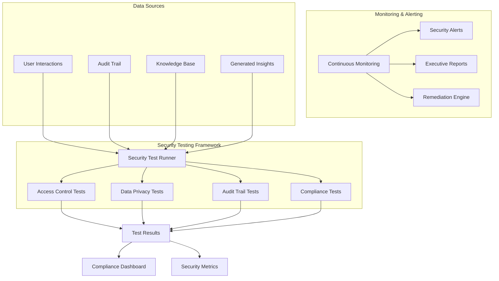

# Security and Compliance Testing Framework

## Overview

The Security and Compliance Testing Framework provides comprehensive validation of security controls, data privacy protection, and regulatory compliance for the Enterprise Knowledge Intelligence Platform. This framework ensures that all AI-powered insights and data processing activities meet enterprise security standards and regulatory requirements.

## Key Features

### 🔐 Role-Based Access Control Validation
- Validates user role assignments and permissions
- Tests access control enforcement across all system components
- Monitors data compartmentalization between departments
- Detects unauthorized access attempts and privilege escalation

### 🛡️ Data Privacy and PII Protection
- AI-powered PII detection in generated insights
- Data retention policy compliance monitoring
- Encryption requirement validation for sensitive data
- Privacy impact assessment tracking

### 📋 Audit Trail and Compliance Reporting
- Comprehensive audit trail completeness validation
- Audit integrity verification using AI analysis
- Automated compliance reporting for major regulations (GDPR, SOX, HIPAA, PCI-DSS)
- Executive-level security posture summaries

### 🚨 Real-Time Security Monitoring
- Continuous monitoring for suspicious activities
- Automated alert generation for security violations
- Data exfiltration pattern detection
- Real-time threat response capabilities

## Architecture



## Test Categories

### 1. Access Control Tests

#### Test 1: Role Assignment Validation
- **Purpose**: Ensures all active users have proper role assignments
- **Frequency**: Daily
- **Severity**: HIGH if failures detected
- **Requirements**: 6.2, 6.4

#### Test 2: Access Control Enforcement
- **Purpose**: Validates that users can only access authorized insights
- **Frequency**: Daily
- **Severity**: CRITICAL if violations detected
- **Requirements**: 6.2, 6.4

#### Test 3: Data Compartmentalization
- **Purpose**: Prevents sensitive data leaks across department boundaries
- **Frequency**: Daily
- **Severity**: HIGH if violations detected
- **Requirements**: 6.2, 6.4

### 2. Data Privacy Tests

#### Test 4: PII Protection Validation
- **Purpose**: Detects PII exposure in AI-generated insights
- **Method**: AI-powered content analysis using Gemini
- **Frequency**: Daily
- **Severity**: CRITICAL if PII detected
- **Requirements**: 6.2, 6.4

#### Test 5: Data Retention Compliance
- **Purpose**: Identifies data exceeding retention policy limits
- **Frequency**: Weekly
- **Severity**: MEDIUM if violations detected
- **Requirements**: 6.2, 6.4

#### Test 6: Encryption Compliance
- **Purpose**: Validates encryption of sensitive data
- **Frequency**: Daily
- **Severity**: HIGH if unencrypted sensitive data found
- **Requirements**: 6.2, 6.4

### 3. Audit Trail Tests

#### Test 7: Audit Trail Completeness
- **Purpose**: Ensures all user interactions are properly logged
- **Frequency**: Daily
- **Severity**: HIGH if missing audit records
- **Requirements**: 6.2, 6.4

#### Test 8: Audit Trail Integrity
- **Purpose**: Detects potential tampering with audit records
- **Method**: AI-powered anomaly detection
- **Frequency**: Daily
- **Severity**: MEDIUM if anomalies detected
- **Requirements**: 6.2, 6.4

### 4. Compliance Tests

#### Test 9: Compliance Reporting Validation
- **Purpose**: Ensures required compliance reports are generated
- **Regulations**: GDPR, SOX, HIPAA, PCI-DSS
- **Frequency**: Daily
- **Severity**: HIGH if reports missing
- **Requirements**: 6.2, 6.4

## Usage Instructions

### Running Security Tests

#### Execute All Tests
```sql
-- Run complete security and compliance test suite
CALL run_all_security_compliance_tests();
```

#### Execute Specific Test Categories
```sql
-- Run only access control tests
CALL test_role_assignments();
CALL test_access_control_enforcement();
CALL test_data_compartmentalization();

-- Run only data privacy tests
CALL test_pii_protection();
CALL test_data_retention_compliance();
CALL test_encryption_compliance();

-- Run only audit trail tests
CALL test_audit_trail_completeness();
CALL test_audit_trail_integrity();

-- Run only compliance tests
CALL test_compliance_reporting();
```

### Monitoring and Alerting

#### Continuous Security Monitoring
```sql
-- Enable continuous monitoring (typically scheduled)
CALL continuous_security_monitoring();
```

#### Generate Executive Summary
```sql
-- Create executive-level security report
CALL generate_security_executive_summary();
```

#### View Security Dashboard
```sql
-- View current security posture
SELECT * FROM `enterprise_knowledge_ai.security_dashboard`
WHERE test_date >= DATE_SUB(CURRENT_DATE(), INTERVAL 7 DAY)
ORDER BY test_date DESC;
```

#### Check Compliance Status
```sql
-- View compliance status across all areas
SELECT * FROM `enterprise_knowledge_ai.compliance_status`
ORDER BY compliance_percentage ASC;
```

### Remediation and Response

#### View Failed Tests
```sql
-- Get all failed tests requiring remediation
SELECT 
  test_name,
  test_category,
  severity_level,
  test_details,
  execution_timestamp
FROM `enterprise_knowledge_ai.security_test_results`
WHERE test_status = 'FAIL'
AND DATE(execution_timestamp) = CURRENT_DATE()
ORDER BY 
  CASE severity_level 
    WHEN 'CRITICAL' THEN 1 
    WHEN 'HIGH' THEN 2 
    WHEN 'MEDIUM' THEN 3 
    ELSE 4 
  END;
```

#### Get Remediation Suggestions
```sql
-- View AI-generated remediation plans
SELECT 
  test_name,
  test_category,
  severity_level,
  remediation_plan
FROM `enterprise_knowledge_ai.remediation_suggestions`
WHERE DATE(generated_timestamp) = CURRENT_DATE()
ORDER BY 
  CASE severity_level 
    WHEN 'CRITICAL' THEN 1 
    WHEN 'HIGH' THEN 2 
    WHEN 'MEDIUM' THEN 3 
    ELSE 4 
  END;
```

## Automated Scheduling

### Daily Security Tests
Set up automated execution using Cloud Scheduler or similar:

```bash
# Example Cloud Scheduler job
gcloud scheduler jobs create http security-compliance-tests \
  --schedule="0 2 * * *" \
  --uri="https://your-cloud-function-url/run-security-tests" \
  --http-method=POST \
  --description="Daily security and compliance testing"
```

### Real-Time Monitoring
Configure continuous monitoring for immediate threat detection:

```sql
-- Schedule continuous monitoring (every 15 minutes)
CALL schedule_security_compliance_tests();
```

## Security Policies

The framework enforces the following security policies:

### Access Control Policy
- **Executive**: Access to PUBLIC, INTERNAL, CONFIDENTIAL data across all departments
- **Manager**: Access to PUBLIC, INTERNAL data within same department
- **Analyst**: Access to PUBLIC, INTERNAL data within same department (no financial data)
- **Viewer**: Access to PUBLIC data within same department only

### Data Retention Policy
- **User Interactions**: 3 years (archive after 1 year)
- **Knowledge Base**: 7 years (archive after 2 years)
- **Audit Trail**: 10 years (archive after 3 years)
- **Compliance Reports**: Permanent (archive after 5 years)

### Encryption Policy
- **CONFIDENTIAL/RESTRICTED**: AES-256 encryption required
- **PII/Financial/Healthcare**: AES-256 encryption required
- **RESTRICTED**: Additional HSM and key rotation controls

## Compliance Frameworks

### GDPR Compliance
- Data processing consent tracking
- Right to be forgotten implementation
- Data portability support
- Privacy impact assessments

### SOX Compliance
- Financial data access controls
- Audit trail integrity
- Change management controls
- Segregation of duties

### HIPAA Compliance
- Healthcare data encryption
- Access logging and monitoring
- Minimum necessary access
- Business associate agreements

### PCI-DSS Compliance
- Payment data protection
- Network security controls
- Regular security testing
- Access control measures

## Metrics and KPIs

### Security Metrics
- **Overall Compliance Score**: Percentage of tests passing
- **Critical Issues**: Number of critical security failures
- **Mean Time to Remediation**: Average time to fix security issues
- **Security Incident Rate**: Number of security incidents per month

### Compliance Metrics
- **Regulatory Compliance Rate**: Percentage compliance per regulation
- **Audit Findings**: Number of audit findings per assessment
- **Policy Violations**: Number of policy violations detected
- **Training Completion Rate**: Percentage of users completing security training

## Troubleshooting

### Common Issues

#### High False Positive Rate in PII Detection
- **Cause**: AI model being overly sensitive
- **Solution**: Adjust AI prompt or implement confidence thresholds
- **Code**: Modify `test_pii_protection()` procedure

#### Missing Audit Records
- **Cause**: Application not properly logging interactions
- **Solution**: Verify audit logging is enabled in all components
- **Code**: Check audit trail insertion triggers

#### Access Control Violations
- **Cause**: Role assignments not properly synchronized
- **Solution**: Implement role synchronization process
- **Code**: Review user role assignment procedures

### Performance Optimization

#### Large Dataset Processing
- Use partitioned tables for better query performance
- Implement incremental testing for large datasets
- Consider sampling for non-critical tests

#### AI Model Optimization
- Cache frequently used AI model results
- Implement batch processing for AI-powered tests
- Use appropriate model sizes for different test types

## Integration with Existing Systems

### SIEM Integration
Export security alerts to your SIEM system:

```sql
-- Export security alerts for SIEM ingestion
SELECT 
  alert_id,
  alert_type,
  severity,
  message,
  created_timestamp,
  JSON_EXTRACT(metadata, '$.source_ip') AS source_ip,
  JSON_EXTRACT(metadata, '$.user_id') AS user_id
FROM `enterprise_knowledge_ai.security_alerts`
WHERE created_timestamp >= TIMESTAMP_SUB(CURRENT_TIMESTAMP(), INTERVAL 1 HOUR)
AND acknowledged = FALSE;
```

### Identity Management Integration
Synchronize with your identity provider:

```sql
-- Sync user roles from identity provider
MERGE `enterprise_knowledge_ai.user_roles` AS target
USING `identity_provider.user_roles` AS source
ON target.user_id = source.user_id
WHEN MATCHED THEN UPDATE SET
  department = source.department,
  role_name = source.role_name,
  authorized_roles = source.authorized_roles,
  last_updated = CURRENT_TIMESTAMP()
WHEN NOT MATCHED THEN INSERT
  (user_id, department, role_name, authorized_roles, created_timestamp)
VALUES
  (source.user_id, source.department, source.role_name, source.authorized_roles, CURRENT_TIMESTAMP());
```

## Support and Maintenance

### Regular Maintenance Tasks
1. **Weekly**: Review and update security policies
2. **Monthly**: Analyze security metrics and trends
3. **Quarterly**: Conduct comprehensive security assessments
4. **Annually**: Update compliance frameworks and requirements

### Monitoring Health Checks
- Verify test execution logs for failures
- Monitor alert generation and response times
- Review remediation suggestion accuracy
- Validate compliance report completeness

For additional support or questions about the Security and Compliance Testing Framework, please refer to the main project documentation or contact the security team.